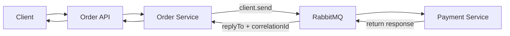
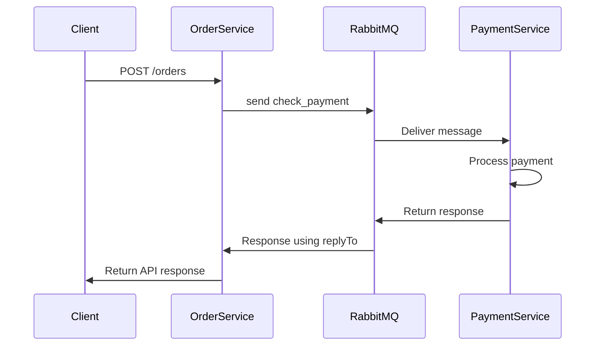

# NestJS RabbitMQ RPC Microservice Example

A complete NestJS microservice example demonstrating RabbitMQ Request/Reply (RPC) communication using:

- `client.send()`
- `@MessagePattern()`
- `firstValueFrom()`
- RabbitMQ Direct Reply-To
- Request/Response Messaging

This project shows how one NestJS service can communicate synchronously with another microservice through RabbitMQ.

---

# Overview

This project contains:

## Order Service

Responsible for:

- Receiving HTTP request
- Sending RabbitMQ request
- Waiting for payment response
- Returning final API response

## Payment Service

Responsible for:

- Consuming RabbitMQ messages
- Processing payment request
- Returning payment response

---

# Architecture



---

# Request / Reply Flow



---

# Technologies Used

| Technology | Purpose |
|---|---|
| NestJS | Backend framework |
| RabbitMQ | Message broker |
| RxJS | Observable handling |
| Docker | RabbitMQ container |
| AMQP | Messaging protocol |

---

# Project Structure

```txt
src
├── main.ts
├── app.module.ts
├── order
│   ├── order.controller.ts
│   ├── order.module.ts
│   └── order.service.ts
└── payment
    ├── payment.controller.ts
    └── payment.module.ts
```

---

# How RabbitMQ RPC Works

This project uses:

```txt
Request → Reply
```

communication.

## Internally RabbitMQ Uses

- `replyTo`
- `correlationId`
- Direct Reply-To Queue

NestJS automatically manages these internally when using:

```ts
client.send()
```

---

# Important Concepts

---

## `client.send()`

Used for request/response communication.

Example:

```ts
const response = await firstValueFrom(
  this.paymentClient.send('check_payment', {
    orderId: 123,
    amount: 500,
  }),
);
```

This means:

```txt
Send RabbitMQ message
Wait for response
Return response
```

---

## `@MessagePattern()`

Used to consume RabbitMQ request messages.

Example:

```ts
@MessagePattern('check_payment')
checkPayment(data: any) {
  return {
    success: true,
    message: 'Payment successful',
  };
}
```

The returned object automatically becomes the RabbitMQ response.

---

## `firstValueFrom()`

NestJS `send()` returns an RxJS Observable.

`firstValueFrom()` converts:

```txt
Observable → Promise
```

allowing:

```ts
await
```

syntax.

---

# RabbitMQ Internal Flow

Internally NestJS sends message like:

```json
{
  "pattern": "check_payment",
  "data": {
    "orderId": 123,
    "amount": 500
  },
  "properties": {
    "replyTo": "amq.rabbitmq.reply-to",
    "correlationId": "abc123"
  }
}
```

---

# Why `replyTo` Is Needed

RabbitMQ needs to know:

```txt
Where should response be sent?
```

The requester includes:

```txt
replyTo
```

queue information.

---

# Why `correlationId` Is Needed

Suppose:

```txt
100 requests are running simultaneously
```

RabbitMQ responses must be matched to correct requester.

`correlationId` solves this.

---

# Difference Between `send()` and `emit()`

| Method | Behavior |
|---|---|
| `client.send()` | Request/Reply |
| `client.emit()` | Fire-and-forget event |

---

## `send()`

Use when response is required.

Example:

- Payment validation
- User verification
- Inventory availability
- Delivery charges

---

## `emit()`

Use when response is NOT required.

Example:

- Email sending
- Notification event
- Analytics tracking
- Logging event
- Background processing

---

# Setup Instructions

---

# 1. Install Dependencies

```bash
npm install
```

Install RabbitMQ packages:

```bash
npm install @nestjs/microservices amqplib amqp-connection-manager rxjs
```

---

# 2. Run RabbitMQ Using Docker

```bash
docker run -d \
--name rabbitmq \
-p 5672:5672 \
-p 15672:15672 \
-e RABBITMQ_DEFAULT_USER=user \
-e RABBITMQ_DEFAULT_PASS=password \
rabbitmq:3-management
```

---

# 3. RabbitMQ Dashboard

```txt
http://localhost:15672
```

Credentials:

```txt
username: user
password: password
```

---

# 4. Run Application

```bash
npm run start:dev
```

---

# API Endpoint

## Create Order

```http
POST /orders
```

---

# Test Using CURL

```bash
curl -X POST http://localhost:3000/orders
```

---

# Expected Response

```json
{
  "orderId": 123,
  "payment": {
    "success": true,
    "message": "Payment successful",
    "transactionId": "TXN-123456789"
  }
}
```

---

# Console Logs

---

## Order Service

```txt
Order Service: sending payment request

Order Service: received response
{
  success: true,
  message: 'Payment successful'
}
```

---

## Payment Service

```txt
Payment Service: request received
{
  orderId: 123,
  amount: 500
}
```

---

# Example Use Cases

This architecture is useful for:

- Payment processing
- User authentication
- Inventory validation
- Fraud checks
- Shipping cost calculation
- OTP verification

---

# When NOT To Use RabbitMQ RPC

Avoid synchronous request/reply for:

- Email sending
- Video processing
- PDF generation
- Image processing
- Report generation
- Long-running jobs

Use asynchronous event-based architecture instead.

---

# Future Improvements

Possible enhancements:

- Retry mechanism
- Dead letter queues
- Timeout handling
- Circuit breaker
- Distributed tracing
- Saga orchestration
- Redis caching
- Kubernetes deployment

---

# Learning Goals

This project helps understand:

- NestJS microservices
- RabbitMQ basics
- Request/Reply messaging
- RPC communication
- RxJS Observable handling
- `firstValueFrom()`
- `replyTo`
- `correlationId`
- Direct Reply-To

---

# Summary

This project demonstrates synchronous microservice communication using RabbitMQ in NestJS.

Core concepts used:

```txt
client.send()
@MessagePattern()
firstValueFrom()
replyTo
correlationId
RabbitMQ RPC
```

NestJS internally handles:

- Reply queues
- Response listeners
- Correlation IDs
- Request/Reply matching

allowing developers to focus on business logic instead of low-level AMQP management.